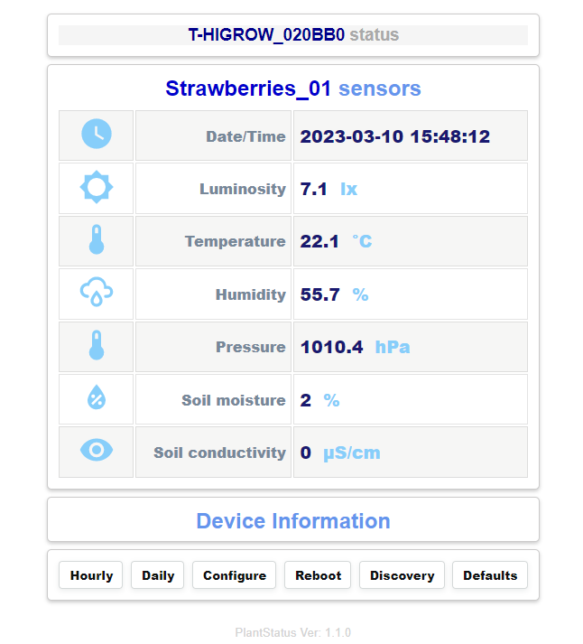

## Plant Status
Plant Status is a plant monitoring and logging application using <a target="_blank" title="Garden Flowers Temperature Moisture Sensor WiFi Bluetooth Wireless Control Meter" href="https://pt.aliexpress.com/item/32815782900.html">**LILYGO TTGO-T-HIGrow**</a> sensor.
Application supports both **DHT** sensors (DHT11,DHT12,DHT22) or the new **BME280** sensor, the **BH1750** light sensor, 
and the internal **soil moisture** and **soil salt** sensor.

## Main features
+ Configure parameters using an **access point** and **config portal** on startup.
+ Publish sensor values in a **mqtt broker**.
+ **Homeassistant** integration using MQTT **auto discovery** interface.
+ **Log** measurements in a daily **csv file** stored in SPIFFS. **View** or **download** the file in browser.
+ **Sensors offsets** for device calibration.
+ User button single Press -> Take measurement.
+ User button long Press -> Connect to network and show a **web page with measurements** on mobile phone.
+ **Websockets** to auto update sensor values in home page (No refresh).
+ **Auto sleep** after no activity.
+ Battery optimization.
+ Mqtt wakeup function and remote configure functions.
+ No need to compile for each device.

## Install
Compile the project using **platformio** or you can download the already compiled firmware from **/firmware** folder 
and upload it to you device using **esptool.py** with command..

esptool.py --port COM5 write_flash -fs 1MB -fm dout 0x0 PlantStatus.bin

## Usage
On first boot **Plant Status** will create an access point named **T-HIGROW_{mac_id}** and wait for a client connection. Use your mobile phone 
to connect and navigate your browser to **192.168.4.1** to enter device **setup portal**.

Application variables can be edited in configuration portal and after making changes using the `Save` button they will be saved to an ini text file to spiffs.

Reboot the device by pressing `Reboot` button. On next loop device will wake up, take a measurement, publish it to mqtt and enter deep sleep again.
During sleep, pressing the **user button** once, will make the device wake up, publish measurements and enter deep sleep again.

Pressing the **user button** for long time (>5 sec) will make device to wake up, publish measurements, start a web server and wait 30 seconds 
for a connection from a web browser. Connect and navigate you browser to device ip to see the live measurements. Measurements are 
updated automatically every 30 secs at home page.

To **re-configure** device press `configure` button from homepage end redirect to configuration page. 

To make device visible in **Home Assistant** press the`HAS discovery` button from home page. A mqtt **auto discovery** messages will be send to Home assistant
to configure **Plant Status** as a mqtt device. Visit **HAS devices** page to see the new **T-HIGROW** MQTT device.

**Active** daily log file can be viewed in the browser by button `Log` in home page. And old history file can be viewed with command ..

`http://192.168.4.1/cmd?view=/data/2023-01/2023-01-30.csv`

An old log file can be donwloaded with comand..

`http://192.168.4.1/download?view=/data/2023-01/2023-01-30.csv`

*(replace dates as needed)*

Remote configuration commands can be send as retained messages from a mosquitto broker. Messages will be delivered on next reboot,
alter the configuration and save to SPIFFS to be loaded on next reboot. Commands can be ``variable``=``val`` in order to set 
a variable to a value, or ``variable``+=``val`` to increase or decrease value.
Valid parameters names with default values are defined in `include/user-variables.h`  line: 27 const char* appConfigDict_json 

Fom example from a mqtt broker server publish the command with the parameter you want to change..

`"offs_pressure=-2.42"` or `"offs_pressure-=.02"`

``mosquitto_pub -r -h {mqtt_host} -u {mqtt_user} -P {mqtt_pass} -t "homeassistant/sensor/{host_name}-{macid}/config" -m "offs_pressure=-2.42"``
 
 *(replace variables surrounded with {}, as needed)*
 
After disconnecting your browser, **device** will automatically enter to deep sleep again to preserve battery.

  

