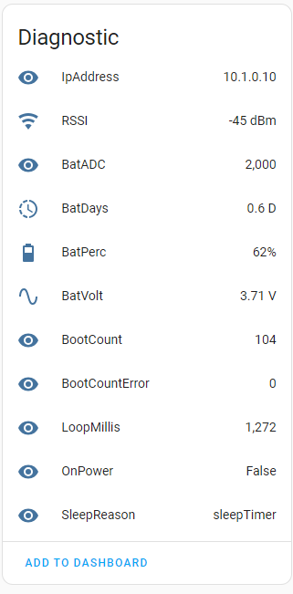
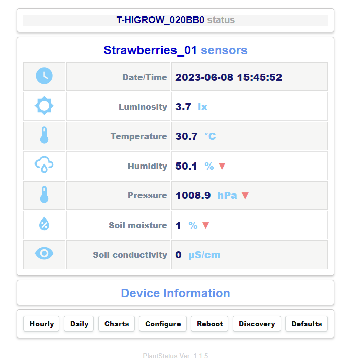

## PlantStatus
**PlantStatus** is a plant monitoring and logging application using <a target="_blank" title="Garden Flowers Temperature Moisture Sensor WiFi Bluetooth Wireless Control Meter" href="https://pt.aliexpress.com/item/32815782900.html">**LILYGO TTGO-T-HIGrow**</a> sensor.
Application supports both **DHT** sensors (DHT11,DHT12,DHT22) or the new **BME280** sensor, the **BH1750** light sensor, 
and the internal **soil moisture** and **soil salt** sensor.

## Main features
+ Configure parameters using an **access point** and **config portal** on startup. Uses 
<a target="_blank" title="ConfigAssist class" href="https://github.com/gemi254/ConfigAssist-ESP32-ESP8266">ConfigAssist</a> library to edit application variables
+ Publish sensor values in a **mqtt broker**.
+ **Homeassistant** integration using MQTT **auto discovery** interface.
+ **Daily** measurements **Log** in a csv file stored in SPIFFS. **View** file in browser.
+ **Monthly** measurements **Logs** in csv files stored in SPIFFS. **View** or **download** the files from browser.
+ User button **single** Press -> Take measurement.
+ User button **long** Press -> Connect to network and show a **web page with measurements** on mobile phone.
+ **Websockets** to auto update sensor values in home page (No refresh).
+ **Sensors offsets** for device calibration.
+ **Auto sleep** after no activity.
+ Battery optimization.
+ Mqtt **remote configure** commands and wakeup function.
+ no need to re-compile for each device.

  
   
  PlanStatus home page.

## Install
Compile the project using **platformio** or you can download the already compiled firmware from **/firmware** folder 
and upload it to you device using **esptool.py** with command..

esptool.py --port COM5 write_flash -fs 1MB -fm dout 0x0 PlantStatus.bin

## Usage
On first boot **Plant Status** will create an access point named **T-HIGROW_{mac}** and wait for a client connection (**{mac}** will be replaced by device id. Use your mobile phone to connect and navigate your browser to **192.168.4.1** to enter device **setup portal**.

Application variables like (Wifi credencials, MQTT, offsets and others) can be edited there with the `Save` button will be saved to an ini text file to spiffs.

Reboot the device by pressing `Reboot` button. On next loop device will wake up, take a measurement, publish it to mqtt and enter deep sleep again.
During sleep, pressing the **user button** once, will make the device wake up, publish measurements and enter deep sleep again.

Pressing the **user button** for long time (>5 sec) will make device to wake up, publish measurements, start a web server and wait 30 seconds 
for a connection from a web browser. Connect and navigate you browser to device ip to see the live measurements. Measurements are 
updated automatically every 30 secs at the home page.

To **re-configure** device press `configure` button from homepage end redirect to configuration portal. 

To make device visible in **Home Assistant** press the`Discovery` button from home page. A mqtt **auto discovery** messages will be send to Home assistant
to configure **PlantStatus** as a mqtt device. Visit **HAS devices** page to see the new **T-HIGROW** MQTT device.

  
  
   
  Home Assistand Mqtt card & device

**Active** daily log file can be viewed in the browser by button `Daily` in home page. 

  
   
  PlantStatus log file view

If spiffs is running out of space Log files are **rotated** and the oldest dir will be deleted.
Old **monthly** history can be viewed with `Logs` button. Navigate in SPIFFS Dates directories and chose a date log file. Use icons to view or download the file.

  
   
  PlantStatus Monthly log view

  
   
  PlantStatus Daily log view

In order to **debug** the application enable **logFile** from **Device settings** in configure section.A log text file  **/log** will be generated
with  debug info that can be viewed from browser while the device is awake with command ``http://{ip_address}/cmd?view=/log``.

The file can also be deleted from browser with **Reset** command ``http://{ip_address}/cmd?resetLog=/log``.

Remote **configuration commands** can be send as **retained** messages from the **mosquitto broker**. Messages will be delivered on next reboot,
alter the configuration and save it to SPIFFS to be loaded on next reboot. Commands can be 
* `variable=val` in order to set a variable to a value
* `variable+=val` to increase or decrease value.

Valid parameters names with default values are defined in `include/user-variables.h`  line: 27 const char* appConfigDict_json 

Fom example from a mqtt broker server publish the command with the parameter you want to change..

`"offs_pressure=-2.42"` or `"offs_pressure-=.02"`

``mosquitto_pub -r -h {mqtt_host} -u {mqtt_user} -P {mqtt_pass} -t "homeassistant/sensor/{host_name}/config" -m "offs_pressure=-2.42"``
 
 *(replace variables surrounded with {}, as needed)*
 
After disconnecting your browser, **device** will automatically enter to **deep sleep** again to preserve battery.

  
   
  PlanStatus info card.

   PlantStatus config page
  

