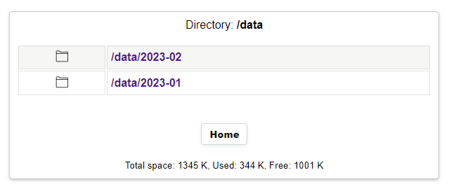

## PlantStatus
**PlantStatus** is a plant monitoring and logging application using <a target="_blank" title="Garden Flowers Temperature Moisture Sensor WiFi Bluetooth Wireless Control Meter" href="https://pt.aliexpress.com/item/32815782900.html">**LILYGO TTGO-T-HIGrow**</a> sensor.
Application supports both **DHT** sensors (DHT11,DHT12,DHT22) or the new **BME280** sensor, the **BH1750** light sensor, 
and the internal **soil moisture** and **soil salt** sensor.

## Main features
+ Display a 24 hour graph of the latest measurements sored in SPIFFS.
+ Take measurements without iternet, using mobile Access point connections only. (Synchronize device time with browser)
+ Configure parameters using an **access point** and **config portal** on startup. Uses 
<a target="_blank" title="ConfigAssist class" href="https://github.com/gemi254/ConfigAssist-ESP32-ESP8266">ConfigAssist</a> library to edit application variables.
+ Publish sensor values in a **mqtt broker**.
+ **Homeassistant** integration using MQTT **auto discovery** interface.
+ **Daily** measurements **Log** in a csv file stored in SPIFFS. **View** file in browser.
+ **Monthly** measurements **Logs** in csv files stored in SPIFFS. **View** or **download** the files from browser.
+ User button **single** Press -> Take measurement an go to sleep.
+ User button **long** Press -> Start webserver and show a **web page with measurements** to connected client.
+ User button **long long** Press (>10 secs) -> Reset device to factory defaults
+ **Websockets** to auto update sensor values in home page (No refresh).
+ **Sensors offsets** for device calibration.
+ **Auto sleep** after no activity.
+ Battery optimization.
+ Mqtt **remote configure** commands and wakeup function.
+ no need to re-compile for each device.

  
   
  PlanStatus home page.

## Install
Compile the project using **platformio** or you can download the already pre-compiled firmware from **/firmware** folder 
and upload it to you device using **esptool.py** with command..

esptool.py --port COM5 write_flash -fs 1MB -fm dout 0x0 PlantStatus.bin

## Usage
On first run **PlantStatus** will create an **access point** named **T-HIGROW_{mac}** (**{mac}** will be replaced by device id) and waits 30 seconds for a client connection. If connection is not established for 30 seconds, device will enter to sleep again. Press user button again to wake up device and activate AP.

Using a mobile phone connect to the **T-HIGROW_{mac}** access point and navigate your browser to **192.168.4.1** to open the device's **Home page**. Pressing the custom button once will take measurements and display, while disconnecting from AP will put the device back to sleep.

Navigate to **Config** '/cfg' to setup the device and connect it to the internet. All application parameters can be edited there like (Wifi credencials, MQTT, offsets and others) and they will be saved to an ini file on spiffs.

Once setup complete, reboot the device by pressing `Reboot` button. On next loop device will wake up, take a measurement, publish it to mqtt and enter deep sleep again. During sleep, pressing the **user button** once, will make the device wake up, publish measurements and enter back to deep sleep again. 

Pressing the **user button** for long time (> 5 sec) will make device to wake up, publish measurements, and start a web server 
waiting connection for 30 seconds from a remote host. Connect and navigate you browser to device ip to see the live measurements.
Device will not enter sleep as soon as a client is connected and measurements are updated automatically every 30 secs.

To **re-configure** device press `configure` button from homepage end redirect to configuration portal. 

To make device visible in **Home Assistant** press the`Discovery` button from home page. Mqtt **auto discovery** messages will be send to **Home assistant** to configure **PlantStatus** as a mqtt device. Visit **HAS devices** page to see the new **T-HIGROW** MQTT device.

  
  
   
  Home Assistand Mqtt card & device

**Active** daily log file can be viewed in the browser by button `Daily` in home page. 

  
   
  PlantStatus log file view

If spiffs is running out of space Log files are **rotated** and the oldest dir will be deleted.
Old **monthly** history can be viewed with `Logs` button. Navigate in SPIFFS directories and chose a date log file. 
Use icons to view or download the file.

  
   
  PlantStatus Monthly log view

  
   
  PlantStatus Daily log view

In order to **debug** the application enable **logFile** from **Device settings** in configure section. 
A log text file  **/log** will be generated with **debug info** that can be viewed from browser while the device is awake. 
If log file is pressent ``Debug log`` and ``Reset log`` buttons will be available in order to vew or reset the log file from your browser.

Pressing the user button for > 10 seconds when the device is not in sleep will make a **Factory reset**. All config files will be
removed from SPIFFS and default values will be loaded. TTGO-T-HIGrow will start an access point on next reboot to reconfigure.

On wifi  **connection failure** pressing the User button for >5 secs will force starting the **Access Point** for reconfigure station connections.

Remote **configuration commands** can be send as **retained** messages from the **mosquitto broker**. Messages will be delivered on next reboot,
alter the configuration and save it to SPIFFS to be loaded on next reboot.

Commands can be 
* `variable=val` in order to set a variable to a value
* `variable+=val` to increase or decrease value.

Valid parameters names with default values are defined in `include/user-variables.h`  line: 27 const char* appConfigDict_json 

Fom example from a mqtt broker server publish the command with the parameter you want to change..

`"offs_pressure=-2.42"` or `"offs_pressure-=.02"`

``mosquitto_pub -r -h {mqtt_host} -u {mqtt_user} -P {mqtt_pass} -t "homeassistant/sensor/{host_name}/config" -m "offs_pressure=-2.42"``
 
 *(replace variables surrounded with {}, as needed)*
 
After disconnecting your browser, **device** will automatically enter to **deep sleep** again to preserve battery.

  
   
  PlanStatus info card.

   PlantStatus config page
  

